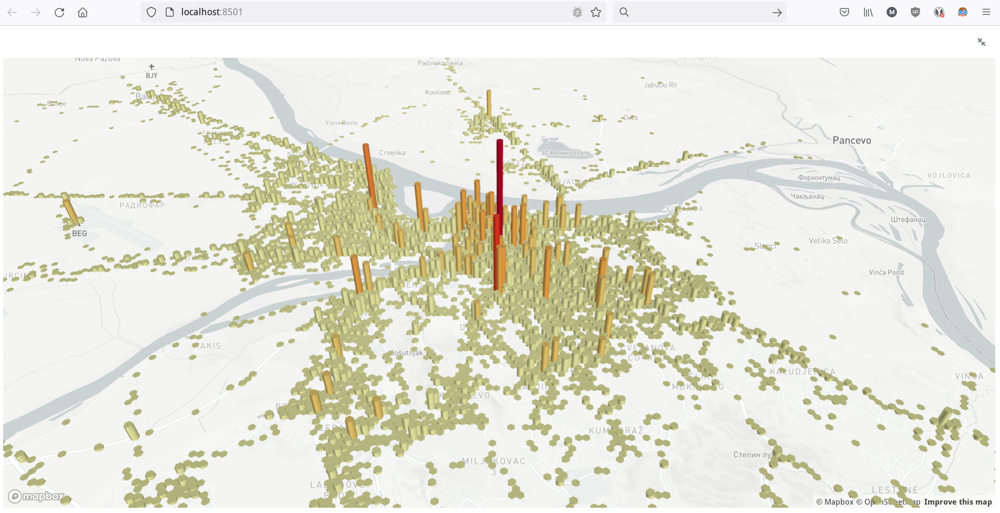

# saobracaj nenesrece
Belgrade traffic accidents map

Data from https://data.gov.rs/sr/datasets/podatsi-o-saobratshajnim-nezgodama-za-teritoriju-grada-beograda/

## Setting up virual envirement
    
    $ sudo pip install virtualenv
    $ virtualenv venv
    $ . venv/bin/activate
    
    $ pip install streamlit
    
    
## Run

    $ ./venv/bin/stremlit run saobracaj.py
    
    
## Screenshots:

